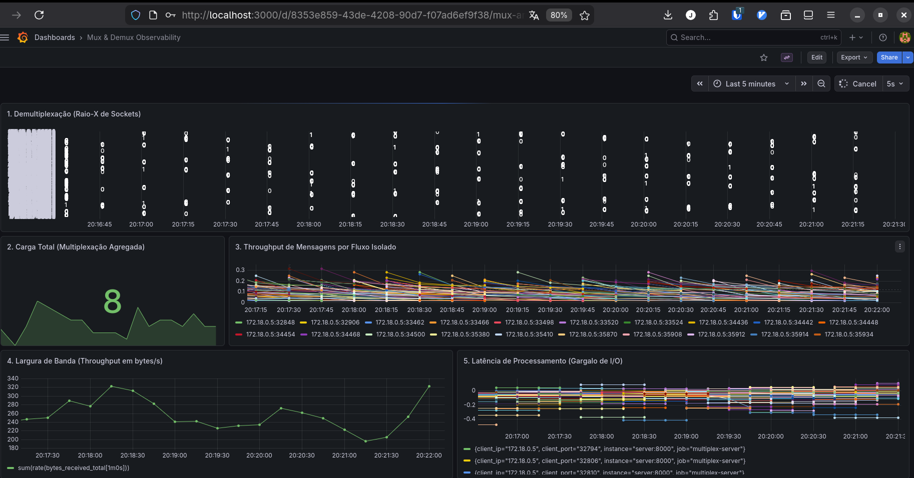
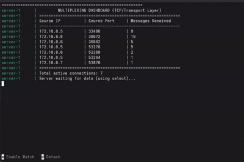

# Multiplexação e Demultiplexação na Camada de Transporte

## Overview

Este projeto demonstra, de forma prática, os conceitos de multiplexação e demultiplexação na camada de transporte com base no modelo TCP/IP.

A implementação consiste em uma aplicação cliente-servidor que gera múltiplos fluxos de comunicação simultâneos e evidencia como esses fluxos são tratados no destino. O controle real dessas operações é realizado pelo kernel do sistema operacional; o projeto torna esse comportamento observável no nível da aplicação.

Além disso, foram integradas ferramentas de observabilidade para coleta e visualização de métricas em tempo real.

### Principais aspectos abordados

* Geração de múltiplos fluxos de comunicação a partir de um único host
* Identificação de conexões por meio da tupla `(IP origem, porta origem, IP destino, porta destino)`
* Uso de portas efêmeras para diferenciação de conexões
* Concorrência no cliente por meio de múltiplas threads
* Multiplexação de I/O no servidor utilizando `select()`
* Monitoramento de métricas com Prometheus
* Visualização de dados com Grafana

### Painéis (Métricas e Resultados)

A instrumentação do projeto reflete o comportamento do tráfego através de cinco perspectivas distintas de observabilidade:


1. **Demultiplexação (Raio-X de Sockets):** Este painel visualiza o resultado da demultiplexação realizada pelo kernel: o servidor Python monitora múltiplas conexões simultaneamente via `select()`, isolando fluxos pelo mapeamento `(IP origem, porta origem)`. Cada linha horizontal representa uma tupla única, demonstrando que conexões de mesmo IP cliente são tratadas independentemente quando possuem portas efêmeras distintas. A demultiplexação em si ocorre na camada de transporte do kernel; a aplicação apenas *observa* o resultado através de sockets distintos.

2. **Carga Total (Multiplexação Agregada):** Exibe o número total de conexões simultaneamente ativas (`sum(active_connections)`). Este painel materializa o conceito de multiplexação de rede: dezenas de sessões geradas por threads independentes que compartilham concorrentemente a mesma interface de rede para o transporte das mensagens.

3. **Throughput de Mensagens por Fluxo Isolado:** Detalha a taxa de recebimento (`rate(messages_received_total[5m]) > 0`) segmentada pela tupla de origem. O filtro `> 0` garante que apenas sockets em atividade sejam exibidos, evitando ruído visual. As linhas multicoloridas com comportamentos independentes confirmam que rajadas (*bursts*) de diferentes fluxos não sofrem colisão (*crosstalk*) — cada fluxo TCP é genuinamente isolado.

4. **Largura de Banda (Throughput em bytes/s):** Ilustra o escoamento global de tráfego via `sum(rate(bytes_received_total[1m]))`. Enquanto o Painel 3 foca no comportamento lógico por fluxo, este painel mede a utilização bruta da interface de rede. A tendência linear indica que o sistema está operando longe da saturação — em ambientes com milhares de conexões simultâneas, `select()` se tornaria gargalo (complexidade O(n)) e `epoll` seria preferível.

5. **Latência de Processamento (`rate(sum) / rate(count)`):** Mede o atraso de processamento no servidor — não a latência de rede (RTT), que em containers Docker na mesma máquina é ~0 µs. O que o gráfico captura é quanto tempo passou entre o cliente enviar a mensagem e o servidor conseguir lê-la, atraso esse causado principalmente pelo ciclo do `select()`: o timestamp `now` é capturado no início de cada iteração do loop, e o `select()` pode bloquear até 1 segundo aguardando dados — quanto mais ocupado o servidor, menor esse atraso, funcionando assim como indicador indireto de carga. Valores negativos ocorrem por *jitter* de microssegundos do escalonador do SO entre o `time.time()` do cliente e o `send()` efetivo, o que não representa erro lógico.

---

## Sumário

* [Como Executar](#como-executar)
* [Estrutura do projeto](#estrutura-do-projeto)
* [Arquitetura](#arquitetura)
* [Camada de Transporte](#camada-de-transporte)
  * [Multiplexação](#multiplexação)
  * [Demultiplexação](#demultiplexação)
* [I/O Multiplexing com select()](#io-multiplexing-com-select)
* [Ciclo de vida de uma conexão](#ciclo-de-vida-de-uma-conexão)
* [Observabilidade com Prometheus](#observabilidade-com-prometheus)
* [Visualização no Grafana](#visualização-no-grafana)
* [Limitações e Escopo](#limitações-e-escopo)
* [Possíveis Extensões](#possíveis-extensões)
* [Resumo das entidades](#resumo-das-entidades)
* [Referências](#referências)

---

## Como Executar

### Pré-requisitos

- [Docker Engine](https://docs.docker.com/engine/install/) 20.10+
- [Docker Compose](https://docs.docker.com/compose/install/) 2.0+

### Passos

```bash
# Clone o repositório
git clone <repo-url>
cd transport-mux-lab

# Inicie toda a infraestrutura (servidor, cliente, Prometheus, Grafana)
docker-compose up -d --build

# Acompanhe os logs em tempo real (opcional)
docker-compose logs -f server
docker-compose logs -f client
```

| Serviço    | URL                           | Credenciais       |
|------------|-------------------------------|-------------------|
| Grafana    | http://localhost:3000         | admin / admin     |
| Prometheus | http://localhost:9090         | —                 |
| Métricas   | http://localhost:8000/metrics | —                 |

> **Nota:** O Grafana e o dashboard são provisionados automaticamente. Nenhuma configuração manual é necessária


### Variáveis de Ambiente

| Variável   | Serviço | Descrição                                                       |
|------------|---------|-----------------------------------------------------------------|
| `HOSTNAME` | cliente | Identificador do container cliente nos logs e no payload TCP.  Injetado automaticamente pelo Docker. |

A saída abaixo representa o estado interno do servidor durante a execução. Cada linha corresponde a um socket identificado por `(IP, porta)`, permitindo observar diretamente o resultado da demultiplexação realizada pelo kernel.

- Conexões são adicionadas dinamicamente após `accept()`
- Mensagens recebidas são contabilizadas por fluxo
- O servidor permanece bloqueado em `select()` aguardando novos eventos


---

## Estrutura do projeto

```bash
transport-mux-lab/
├── docker-compose.yml              # orquestra a infra (server, client×3, prometheus, grafana)
├── server/
│   ├── Dockerfile
│   ├── requirements.txt            # dependências Python do servidor
│   └── server.py                   # núcleo: select() + demultiplexação + métricas
├── client/
│   ├── Dockerfile
│   └── client.py                   # multiplexador: 5 threads × 3 réplicas = 15 fluxos
├── prometheus/
│   └── prometheus.yml              # config do coletor de métricas
└── grafana/
    ├── provisioning/
    │   ├── datasources/
    │   │   └── datasource.yml      # vinculação automática do Grafana ao Prometheus
    │   └── dashboards/
    │       └── dashboards.yml      # aponta os dashboards que o Grafana deve carregar
    └── dashboards/
        └── multiplex_dashboard.json # os 5 painéis de observabilidade
```

---

## Arquitetura

A implementação cria uma comunicação cliente-servidor que torna visível o comportamento da camada de transporte: múltiplos fluxos sendo tratados simultaneamente por um único servidor.

> **Importante:** O projeto não implementa o TCP em si. A multiplexação e demultiplexação reais são realizadas pelo kernel. A aplicação *simula* múltiplos fluxos e *observa* a separação que o kernel já realizou.


```
+--------------------+       +-----------------+       +-----------------------+       +--------------------+
|     CLIENTE        |       |     REDE        |       |      SERVIDOR         |       |  MONITORAMENTO     |
+--------------------+       +-----------------+       +-----------------------+       +--------------------+
| 3 Containers       |       |                 |       | 1 Processo            |       | Grafana (:3000)    |
| ├─ 5 threads/cont. |       | Docker Bridge   |       | ├─ select() monitora  |       |   ▲                |
| └─ 1 socket/thread | ====> | (172.18.0.0/16) | ====> | │  N sockets          |       |   │ (Lê dados)     |
|                    |       |                 |       | └─ conexões demultip. |       |   │                |
| Total: 15 conexões |       |                 |       |                       |       | Prometheus (:9090) |
| (portas efêmeras)  |       |                 |       | (Métricas expostas    | - - - |   ▲                |
|                    |       |                 |       |  em :8000/metrics)    | scrape|   │                |
+--------------------+       +-----------------+       +-----------------------+       +---┘----------------+
   
```

- **Cliente** → gera múltiplos fluxos simultâneos (multiplexação)
- **Servidor** → recebe e separa os fluxos (demultiplexação)
- **Prometheus** → coleta métricas do servidor
- **Grafana** → visualiza essas métricas

---

## Camada de Transporte

A camada de transporte (TCP/UDP) é responsável pela comunicação entre processos e pela entrega confiável de dados (TCP). A identificação de origem e destino usa:

- **IP** → identifica o *host*
- **Porta** → identifica o *processo* via socket

A camada de rede entrega dados entre hosts; a camada de transporte entrega dados entre processos dentro desses hosts.

Assim, cada fluxo de comunicação é identificado pela tupla:

```
(IP origem, porta origem, IP destino, porta destino)
```

### Multiplexação

Multiplexação é o processo realizado no host de origem: a camada de transporte coleta dados de diferentes sockets, encapsula em segmentos e os envia pela camada de rede.

No contexto do projeto, isso acontece no cliente:

- Múltiplas threads representam múltiplos fluxos lógicos concorrentes
- Cada thread cria um socket TCP — o SO registra cada socket em um file descriptor separado
- Cada socket estabelece uma conexão independente e recebe uma porta efêmera distinta

Apesar disso, todos esses fluxos compartilham o mesmo IP e a mesma interface de rede, caracterizando a multiplexação.

#### Infraestrutura de rede

Neste projeto, a rede é a Docker bridge network: uma rede local virtual criada pelo Docker que funciona como um switch virtual, onde cada container recebe uma interface de rede virtual e um IP próprio.

Mesmo compartilhando a mesma infraestrutura, os fluxos são diferenciados por suas portas efêmeras:

```
IP:Porta origem  | IP:Porta destino
172.18.0.5:36230 | 172.18.0.3:5000
172.18.0.5:36232 | 172.18.0.3:5000
172.18.0.5:36234 | 172.18.0.3:5000
```

#### Threads para geração de concorrência

**Justificativa:** threads representam múltiplos processos lógicos concorrentes. Embora a teoria trate de processos independentes, threads dentro de um mesmo processo também são capazes de gerar múltiplos fluxos TCP, pois o SO gerencia cada socket de forma independente.

**Mecanismo:** cada thread chama `socket.socket()`, criando uma struct socket associada a um file descriptor único na tabela do processo. Isso garante isolamento total entre os fluxos no nível do kernel.

**Resultado:** cada conexão TCP recebe uma porta efêmera distinta, atribuída automaticamente pelo kernel — tornando a multiplexação observável no Grafana.

### Demultiplexação

Demultiplexação é o processo realizado no host de destino: a camada de transporte recebe segmentos da camada de rede e entrega os dados ao socket correto (não diretamente ao processo, mas ao socket associado ao processo).

#### TCP

Um socket TCP é identificado pela tupla de quatro elementos:
```
(IP origem, porta origem, IP destino, porta destino)
```

Conexões diferentes — mesmo que para o mesmo servidor — são tratadas separadamente. Em `server.py`, a aplicação reflete esse mapeamento:

```python
clients[client_socket] = client_address  # socket → (IP, porta)
addr = clients[sock]                     # recupera origem ao receber dados
```

> **Importante:** o kernel já realizou a demultiplexação real dos segmentos TCP para sockets *antes* da aplicação acessar os dados. O `recv()` já recebe dados do socket correto; a aplicação apenas organiza e rotula essas informações.

---

## I/O Multiplexing com select()

Além da multiplexação da camada de transporte, o servidor utiliza I/O multiplexing para monitorar múltiplos sockets com um único fluxo de execução.

Sem isso, o servidor teria que bloquear em um único socket ou criar uma thread por conexão. O `select()` resolve esse problema perguntando ao SO: *"quais sockets possuem dados disponíveis para leitura?"*

```python
ready_to_read, _, _ = select.select(sockets_monitorados, [], [], 1.0)
```

> **Limitação de escala:** `select()` varre toda a lista a cada chamada — complexidade O(n). Para >1.000 conexões simultâneas, `epoll` (Linux) ou `kqueue` (BSD) seriam preferíveis por ter complexidade O(1) por evento.

---

## Ciclo de vida de uma conexão
Cada chamada de alto nível (connect, send, close) corresponde a transições de estado no protocolo TCP, gerenciadas pelo kernel.

```
Cliente                          Servidor
  │                                  │
  │──── connect() ──────────────────►│  accept() → novo socket
  │                                  │  registrado em sockets_monitorados
  │──── send(msg + timestamp) ──────►│  recv() → latência calculada
  │◄─── ACK ────────────────────────│  métricas atualizadas
  │         ... (3-10 mensagens) ... │
  │──── close() ────────────────────►│  recv() == b'' → handle_disconnection()
  │                                  │  ACTIVE_CONNECTIONS.set(0)
```


No código, isso se manifesta como:
```python
# Cliente
client.connect(("server", 5000))  # 3-way handshake implícito
client.send(msg.encode())         # ESTABLISHED
client.close()                    # 4-way termination implícito

# Servidor
client_socket, addr = server.accept()  # pós-handshake
data = sock.recv(1024)                 # leitura em ESTABLISHED
if not data: handle_close()            # detecta FIN
```
---

## Observabilidade com Prometheus

A instrumentação foi projetada para responder às perguntas operacionais mais relevantes sobre o tráfego multiplexado.

### Tipos de métricas utilizadas

#### Gauge (estado instantâneo)
- `active_connections` — conexões ativas no momento (por tupla IP:porta)

#### Counter (eventos acumulativos)
- `messages_received_total` — número de mensagens recebidas (por tupla IP:porta)
- `bytes_received_total` — bytes recebidos (por tupla IP:porta)

#### Histogram (distribuição)
- `message_latency_seconds` — tempo entre envio (cliente) e recebimento (servidor)

### Perguntas respondidas

| Pergunta                               | Painel / Métrica                                          |
|----------------------------------------|-----------------------------------------------------------|
| Quantas conexões simultâneas existem?  | Painel 2 — `sum(active_connections)`                     |
| Qual fluxo está mais ativo?            | Painel 3 — `rate(messages_received_total[5m])`           |
| Qual a taxa de bytes/s?                | Painel 4 — `sum(rate(bytes_received_total[1m]))`         |
| Existe gargalo de processamento?       | Painel 5 — `rate(message_latency_seconds_sum[5m]) / rate(message_latency_seconds_count[5m])` |
| Há crosstalk entre fluxos?             | Painel 3 — linhas independentes sem interferência        |
| O servidor está saturado?              | Painel 5 — latência crescente indica gargalo             |

---

## Visualização no Grafana

O dashboard foi estruturado em 5 painéis complementares:

### 1. Demultiplexação visual (State Timeline)

```promql
active_connections == 1
```

Cada linha representa uma tupla `IP:porta` única. O painel mostra:
- Nascimento da conexão (ativação)
- Duração da sessão
- Encerramento (desativação)

É a representação visual direta da demultiplexação: o kernel separou cada fluxo, e o Grafana torna esse resultado observável.

### 2. Carga total (Multiplexação Agregada)

```promql
sum(active_connections)
```

Visão agregada do número de conexões simultâneas. Picos e vales refletem o comportamento de sessões efêmeras (3-10 mensagens por thread).

### 3. Throughput por fluxo isolado

```promql
rate(messages_received_total[5m]) > 0
```

Atividade individual de cada conexão. O filtro `> 0` exibe apenas sockets ativos. Linhas multicoloridas com comportamentos independentes comprovam a ausência de crosstalk.

### 4. Largura de banda

```promql
sum(rate(bytes_received_total[1m]))
```

Volume total de dados processados pelo servidor. Tendência linear indica operação longe da saturação.

### 5. Latência média

```promql
rate(message_latency_seconds_sum[5m]) / rate(message_latency_seconds_count[5m])
```

Latência média entre geração (cliente) e processamento (servidor). Valores negativos são esperados: veja explicação de *jitter* na seção [Limitações e Escopo](#limitações-e-escopo).

---

## Conclusão

O projeto evidencia que, embora a multiplexação e demultiplexação sejam responsabilidades do kernel, seus efeitos podem ser observados no nível da aplicação através de sockets e métricas.

A análise dos painéis demonstra que múltiplos fluxos TCP coexistem sem interferência, sendo corretamente isolados pela tupla (IP, porta), enquanto o servidor consegue tratá-los concorrentemente utilizando I/O multiplexing.

Isso valida, na prática, os conceitos teóricos da camada de transporte.


## Limitações e Escopo

Este projeto teve como base a curiosidade para transpor algo mais baixo nível em algo "visualizável". Dito isso, é necessário destacar que:

- A demultiplexação real é realizada pelo **kernel** (stack TCP/IP). A aplicação apenas *observa* o resultado através de sockets distintos retornados por `accept()`.
- `select()` é adequado para fins educacionais, mas em produção com milhares de conexões, mecanismos como `epoll` seriam preferíveis.
- A latência medida por timestamps de aplicação não representa latência de rede real (RTT), apenas o tempo entre geração e processamento da mensagem. Valores negativos ocorrem devido ao *jitter* de `time.time()` e ao escalonamento do SO em containers que compartilham o relógio do host.
- Não há garantia de ordenação entre sessões de threads diferentes; o comportamento é propositalmente não determinístico para simular tráfego real.

---

## Possíveis Extensões
Assim que possível (e viável), gostaria de explorar mais os tópicos a seguir:
- **Limite de conexões:** implementar fila de `listen()` reduzida e observar o comportamento de overflow.
- **Desconexões abruptas:** tentar simular perda de pacotes (SIGKILL no cliente) para testar a robustez do `cleanup_client()`.
- **select() vs epoll:** comparar performance.

---

## Resumo das entidades

### No cliente
* Threads geram concorrência — cada uma com seu próprio socket e porta efêmera
* O SO gerencia o envio e atribui portas efêmeras automaticamente
* `HOSTNAME` identifica o container nos logs e no payload das mensagens

### Na rede
* Pacotes são roteados pelo IP pela Docker bridge network
* TCP garante entrega confiável e ordenação dentro de cada fluxo

### No servidor
* `select()` faz I/O multiplexing — um único processo atende N conexões
* Cada socket representa uma conexão única identificada por tupla `(IP, porta)`
* Dados são separados por origem antes mesmo de `recv()` ser chamado (kernel)

---

## Referências

- Kurose, J. F.; Ross, K. W.
  *Computer Networking: A Top-Down Approach* — Capítulo 3.2 (Multiplexação e Demultiplexação)

- Python Software Foundation
  [socket — Low-level networking interface](https://docs.python.org/3/library/socket.html#socket.socket.accept)

- Python Software Foundation
  [select — Waiting for I/O completion](https://docs.python.org/3/library/select.html)

- Prometheus Documentation
  [Metric types](https://prometheus.io/docs/concepts/metric_types/)

- Docker Documentation
  [Bridge network drivers](https://docs.docker.com/engine/network/drivers/bridge/)